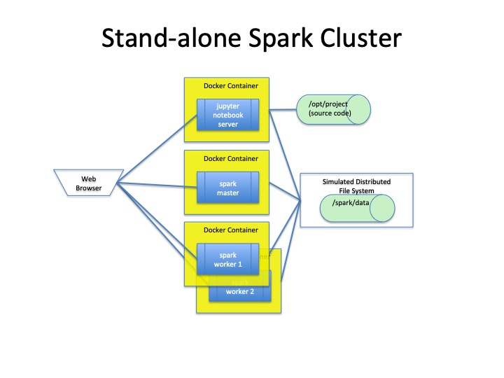
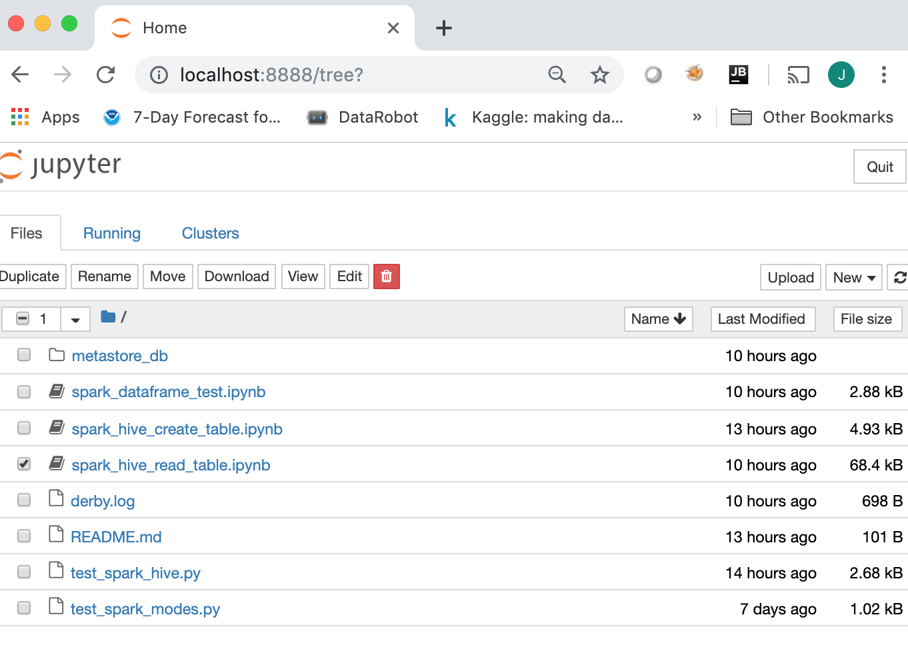
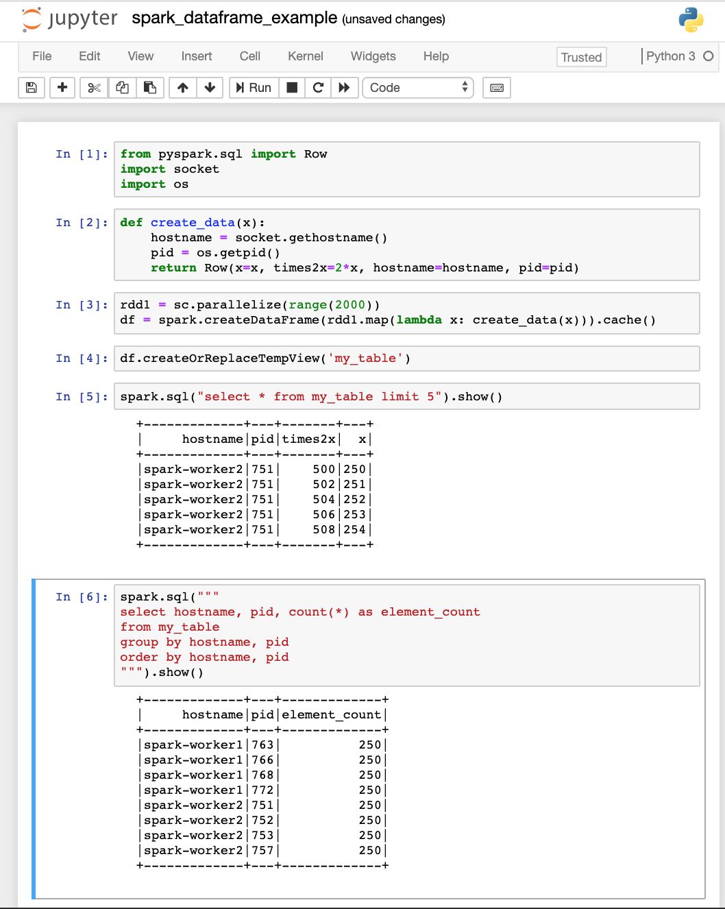

# Stand-alone Spark Cluster Using Docker Containers

## Overview

This repo demonstrates how to run a stand-alone Spark cluster using Docker Containers and `docker-compose`.  The work describe here was performed on a MacBook Pro (MacOS 10.14.4) and Docker for Mac (2.0.0.3).




## Building the Docker Images
Three Docker images are required to run the Spark cluster:
* `spark-master` - Spark Stand-alone Cluster manager
* `spark-worker` - Spark worker process
* `spark-pyspnb` - PySpark Jupyter Notebook Server

These three images are based on a custom `spark-base` image built using the [`continuumio/anaconda3`](https://hub.docker.com/r/continuumio/anaconda3/), which provides the the required Python libraries.  To this image we add the following to provide the Spark run-time:
* Java 1.8
* Apache Spark ([pre-built binaries](https://spark.apache.org/downloads.html))
* Miscellenous system utilities to support running Apache Spark

First configure the build script (`docker/build_images.sh`) to specify software versions desired.  If different versions are desired, then these parameters can be changed.
```python
# Version of ContinuumIO's Anaconda3 docker image to use as the base image 
ANACONDA3_VERSION=5.3.0

# Version of pre-built  Apache spark and Hadoop from spark.apache.org
APACHE_SPARK_VERSION=2.4.1
HADOOP_VERSION=2.7

# Version of py4j used in the Spark build
PY4J_VERSION=0.10.7
```

Run the following command to build the required images:
```
cd docker
./build_images.sh
```

## Starting Stand-alone Spark Cluster
First, specify the parameters to be used in `docker-compose`.  These parameters are specified in the `.env`.  A sample file (`sprkclstr/dot_env`) is provided in this repo.  Modify the parameters as needed then rename `dot_env` to `.env`.

Contents of `sprkclstr/dot_env`:
```
#
# Sample file.  Rename this to .env after specifying values for the variables below
# Environment variables to set for docker-compose file
#

# Docker image tag for the version of Spark to run
APACHE_SPARK_VERSION=2.4.1

# Fully qualified path to directory containing source that will be attached the PySpark Jupyter Notebook container.
# This is mapped `/opt/project` in the container.
CODE_DIR=/top_level_dir/subdir1/subdir1/code_dir

# Fully qualified path to directory that will serve as the persistent storage for the simulated distributed file system.
# This is mapped `/spark/data` in the container.
DATA_DIR=/top_level_dir/subdirx/data_dir
```

After modifying `sprkclstr/dot_env` and renaming to `sprkclstr/.env`, the Spark cluster can be started as follows:
```
cd sprkclstr
docker-compose up --detach
```

To verify the cluster successfully started, run the `docker-compose ps` command.  The output should look similar to below.  
```
       Name                      Command               State                                   Ports                                 
-------------------------------------------------------------------------------------------------------------------------------------
sprkclstr_master_1    /usr/bin/tini -- /spark/st ...   Up      0.0.0.0:8080->8080/tcp                                                
sprkclstr_pyspnb_1    /usr/bin/tini -- /spark/st ...   Up      0.0.0.0:4040->4040/tcp, 0.0.0.0:4041->4041/tcp, 0.0.0.0:8888->8888/tcp
sprkclstr_worker1_1   /usr/bin/tini -- /spark/st ...   Up      0.0.0.0:18081->18081/tcp                                              
sprkclstr_worker2_1   /usr/bin/tini -- /spark/st ...   Up      0.0.0.0:28081->28081/tcp 
```

## Shutdown Stand-alone Spark Cluster
From the root directory execute this command
```
cd sprkclstr
docker-compose down
```

## Accessing the Cluster
The following web UIs are available:

|WEB UI|URL|
|------|---|
|PySpark Jupyter Notebook Server|`http://localhost:8888`|
|Spark Master Web UI|`http://localhost:8080`|


### Screen shots of using Pyspark Jupyter Notebook Server (`http://localhost:8888`)


