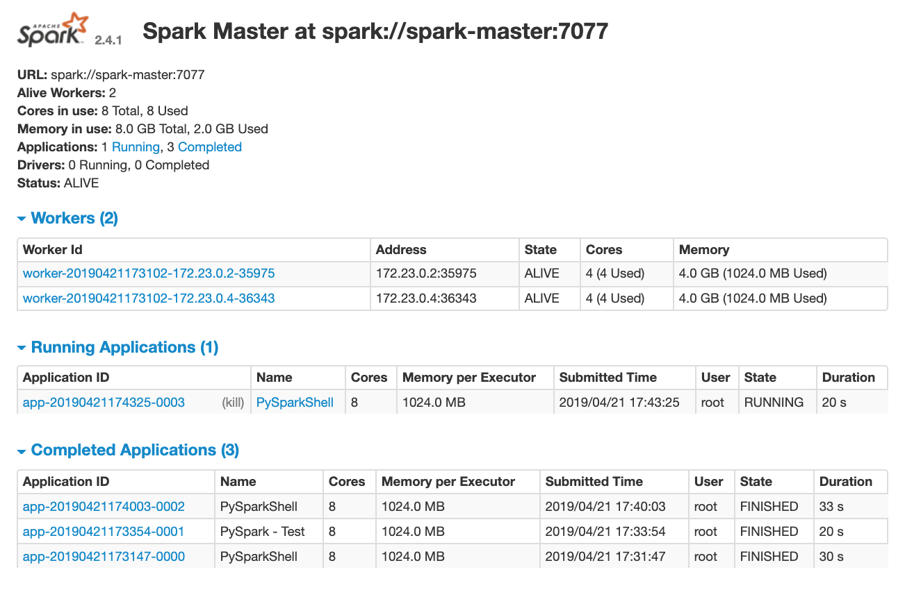

# Stand-alone Spark Cluster Using Docker Containers

This [blog posting](https://medium.com/@marcovillarreal_40011/creating-a-spark-standalone-cluster-with-docker-and-docker-compose-ba9d743a157f) inspired the work described in this repo.  The steps described in this repo use a different approach in creating the Docker images.  One result of this different approach is the availability of a PySpark Jupyter Notebook Server.

## Overview

This repo demonstrates how to run a stand-alone Spark cluster using Docker Containers and `docker-compose`.  The work describe here was performed on a MacBook Pro (MacOS 10.14.4) and Docker for Mac (2.0.0.3).


## Building the Docker Images
Three Docker images are required to run the Spark cluster:
* `spark-master` - Spark Stand-alone Cluster manager
* `spark-worker` - Spark worker process
* `spark-pyspnb` - PySpark Jupyter Notebook Server

These three images are based on a custom `spark-base` image built using the [`continuumio/anaconda3`](https://hub.docker.com/r/continuumio/anaconda3/) image, which provides the the required Python libraries.  To this image we add the following to provide the Spark run-time:
* Java 1.8
* Apache Spark ([pre-built binaries](https://spark.apache.org/downloads.html))
* Miscellenous system utilities to support running Apache Spark

First configure the build script (`docker/build_images.sh`) to specify software versions desired.  If different versions are desired, then these parameters can be changed.
```
# Version of ContinuumIO's Anaconda3 docker image to use as the base image 
ANACONDA3_VERSION=5.3.0

# Version of pre-built  Apache spark and Hadoop from spark.apache.org
APACHE_SPARK_VERSION=2.4.1
HADOOP_VERSION=2.7

# Version of py4j used in the Spark build
PY4J_VERSION=0.10.7
```

Run the following command to build the required images:
```
cd docker
./build_images.sh
```

## Starting Stand-alone Spark Cluster
First, specify the parameters to be used in `docker-compose`.  These parameters are specified in the `.env`.  A sample file (`sprkclstr/dot_env`) is provided in this repo.  Modify the parameters as needed then rename `dot_env` to `.env`.

Contents of `sprkclstr/dot_env`:
```
#
# Sample file.  Rename this to .env after specifying values for the variables below
# Environment variables to set for docker-compose file
#

# Docker image tag for the version of Spark to run
APACHE_SPARK_VERSION=2.4.1

# Fully qualified path to directory containing source that will be attached the PySpark Jupyter Notebook container.
# This is mapped `/opt/project` in the container.
CODE_DIR=/top_level_dir/subdir1/subdir1/code_dir

# Fully qualified path to directory that will serve as the persistent storage for the simulated distributed file system.
# This is mapped `/spark/data` in the container.
DATA_DIR=/top_level_dir/subdirx/data_dir
```

After modifying `sprkclstr/dot_env` and renaming to `sprkclstr/.env`, the Spark cluster can be started as follows:
```
cd sprkclstr
docker-compose up --detach
```

To verify the cluster successfully started, run the `docker-compose ps` command.  The output should look similar to below.  
```
       Name                      Command               State                                   Ports                                 
-------------------------------------------------------------------------------------------------------------------------------------
sprkclstr_master_1    /usr/bin/tini -- /spark/st ...   Up      0.0.0.0:8080->8080/tcp                                                
sprkclstr_pyspnb_1    /usr/bin/tini -- /spark/st ...   Up      0.0.0.0:4040->4040/tcp, 0.0.0.0:4041->4041/tcp, 0.0.0.0:8888->8888/tcp
sprkclstr_worker1_1   /usr/bin/tini -- /spark/st ...   Up      0.0.0.0:18081->18081/tcp                                              
sprkclstr_worker2_1   /usr/bin/tini -- /spark/st ...   Up      0.0.0.0:28081->28081/tcp 
```

## Shutdown Stand-alone Spark Cluster
From the root directory execute this command
```
cd sprkclstr
docker-compose down
```

## Web Access to the Stand-alone Spark Cluster
The following web UIs are available:

|WEB UI|URL|
|------|---|
|PySpark Jupyter Notebook Server|`http://localhost:8888`|
|Spark Master Web UI|`http://localhost:8080`|


### \>\> Screen shots of Pyspark Jupyter Notebook Server (`http://localhost:8888`) \<\<
### Jupyter Notebook Home Page


### Example PySpark Jupyter Notebook


### \>\> Screen shots of Spark Master Web UI (`http://localhost:8080`) \<\<
### Spark Master Web UI - Main Page



### Spark Job Web UI


## Using `spark-submit` on the Stand-alone Spark Cluster
In addition to a PySpark Jupyter Notebook Server, it is possible to use the `spark-submit` cli to submit work to the cluster.  These are the steps to use `spark-submit`:

* Connect to the `pyspnb` container using `docker exec -it sprkclstr_pyspnb_1 /bin/bash` command.  Note:  Container name is the one dispalyed for the `pyspnb` image shown by the `docker-compose ps` command.
* Once connected, remove the `PYSPARK_DRIVER_PYTHON` environment variable by executing this command `unset PYSPARK_DRIVER_PYTHON`
* Navigate to the container directory containing program to run with `spark-submit`
* Execute the `spark-submit` command

Following is an example of the above steps.
```
Jim-MacBook-Pro:~ jim$ docker exec -it sprkclstr_pyspnb_1 /bin/bash

(base) root@4ff5c2e8ebe6:/# unset PYSPARK_DRIVER_PYTHON

(base) root@4ff5c2e8ebe6:/# pwd
/

(base) root@4ff5c2e8ebe6:/# cd /opt/project

(base) root@4ff5c2e8ebe6:/opt/project# ls
README.md    derby.log	   spark_dataframe_example.ipynb  spark_hive_create_table.ipynb
__pycache__  metastore_db  spark_dataframe_example.py	  spark_hive_read_table.ipynb

(base) root@4ff5c2e8ebe6:/opt/project# spark-submit --master spark://master:7077 spark_dataframe_example.py
19/04/21 14:14:30 WARN NativeCodeLoader: Unable to load native-hadoop library for your platform... using builtin-java classes where applicable
Using Spark's default log4j profile: org/apache/spark/log4j-defaults.properties
19/04/21 14:14:31 INFO SparkContext: Running Spark version 2.4.1
19/04/21 14:14:31 INFO SparkContext: Submitted application: PySpark - Test
19/04/21 14:14:31 INFO SecurityManager: Changing view acls to: root
19/04/21 14:14:31 INFO SecurityManager: Changing modify acls to: root
19/04/21 14:14:31 INFO SecurityManager: Changing view acls groups to:
19/04/21 14:14:31 INFO SecurityManager: Changing modify acls groups to:
19/04/21 14:14:31 INFO SecurityManager: SecurityManager: authentication disabled; ui acls disabled; users  with view permissions: Set(root); groups with view permissions: Set(); users  with modify permissions: Set(root); groups with modify permissions: Set()
19/04/21 14:14:31 INFO Utils: Successfully started service 'sparkDriver' on port 36991.
19/04/21 14:14:31 INFO SparkEnv: Registering MapOutputTracker
19/04/21 14:14:31 INFO SparkEnv: Registering BlockManagerMaster
19/04/21 14:14:31 INFO BlockManagerMasterEndpoint: Using org.apache.spark.storage.DefaultTopologyMapper for getting topology information
19/04/21 14:14:31 INFO BlockManagerMasterEndpoint: BlockManagerMasterEndpoint up
19/04/21 14:14:31 INFO DiskBlockManager: Created local directory at /tmp/blockmgr-1fb4e05f-a128-49ac-bb0a-ea08476f0cf0
19/04/21 14:14:31 INFO MemoryStore: MemoryStore started with capacity 366.3 MB
19/04/21 14:14:31 INFO SparkEnv: Registering OutputCommitCoordinator
19/04/21 14:14:31 INFO Utils: Successfully started service 'SparkUI' on port 4040.
19/04/21 14:14:31 INFO SparkUI: Bound SparkUI to 0.0.0.0, and started at http://localhost:4040
19/04/21 14:14:31 INFO StandaloneAppClient$ClientEndpoint: Connecting to master spark://master:7077...
19/04/21 14:14:31 INFO TransportClientFactory: Successfully created connection to master/172.24.0.5:7077 after 25 ms (0 ms spent in bootstraps)
19/04/21 14:14:31 INFO StandaloneSchedulerBackend: Connected to Spark cluster with app ID app-20190421141431-0012
19/04/21 14:14:31 INFO StandaloneAppClient$ClientEndpoint: Executor added: app-20190421141431-0012/0 on worker-20190421111253-172.24.0.3-34235 (172.24.0.3:34235) with 4 core(s)
19/04/21 14:14:31 INFO StandaloneSchedulerBackend: Granted executor ID app-20190421141431-0012/0 on hostPort 172.24.0.3:34235 with 4 core(s), 1024.0 MB RAM
19/04/21 14:14:31 INFO StandaloneAppClient$ClientEndpoint: Executor added: app-20190421141431-0012/1 on worker-20190421111253-172.24.0.2-45981 (172.24.0.2:45981) with 4 core(s)
19/04/21 14:14:31 INFO StandaloneSchedulerBackend: Granted executor ID app-20190421141431-0012/1 on hostPort 172.24.0.2:45981 with 4 core(s), 1024.0 MB RAM
19/04/21 14:14:31 INFO Utils: Successfully started service 'org.apache.spark.network.netty.NettyBlockTransferService' on port 45187.
19/04/21 14:14:31 INFO NettyBlockTransferService: Server created on 4ff5c2e8ebe6:45187
19/04/21 14:14:31 INFO BlockManager: Using org.apache.spark.storage.RandomBlockReplicationPolicy for block replication policy
19/04/21 14:14:31 INFO StandaloneAppClient$ClientEndpoint: Executor updated: app-20190421141431-0012/1 is now RUNNING
19/04/21 14:14:31 INFO StandaloneAppClient$ClientEndpoint: Executor updated: app-20190421141431-0012/0 is now RUNNING
19/04/21 14:14:32 INFO BlockManagerMaster: Registering BlockManager BlockManagerId(driver, 4ff5c2e8ebe6, 45187, None)
19/04/21 14:14:32 INFO BlockManagerMasterEndpoint: Registering block manager 4ff5c2e8ebe6:45187 with 366.3 MB RAM, BlockManagerId(driver, 4ff5c2e8ebe6, 45187, None)
19/04/21 14:14:32 INFO BlockManagerMaster: Registered BlockManager BlockManagerId(driver, 4ff5c2e8ebe6, 45187, None)
19/04/21 14:14:32 INFO BlockManager: Initialized BlockManager: BlockManagerId(driver, 4ff5c2e8ebe6, 45187, None)
19/04/21 14:14:32 INFO StandaloneSchedulerBackend: SchedulerBackend is ready for scheduling beginning after reached minRegisteredResourcesRatio: 0.0
19/04/21 14:14:32 INFO SharedState: Setting hive.metastore.warehouse.dir ('null') to the value of spark.sql.warehouse.dir ('file:/opt/project/spark-warehouse').
19/04/21 14:14:32 INFO SharedState: Warehouse path is 'file:/opt/project/spark-warehouse'.
19/04/21 14:14:32 INFO StateStoreCoordinatorRef: Registered StateStoreCoordinator endpoint
19/04/21 14:14:39 WARN ObjectStore: Failed to get database global_temp, returning NoSuchObjectException
+------------+----+-------+---+
|    hostname| pid|times2x|  x|
+------------+----+-------+---+
|3d1da9c6f40e|1349|      0|  0|
|3d1da9c6f40e|1349|      2|  1|
|3d1da9c6f40e|1349|      4|  2|
|3d1da9c6f40e|1349|      6|  3|
|3d1da9c6f40e|1349|      8|  4|
+------------+----+-------+---+

+------------+----+-------------+
|    hostname| pid|element_count|
+------------+----+-------------+
|3d1da9c6f40e|1349|         1000|
|6fca5a0b7d67|1356|         1000|
+------------+----+-------------+

```