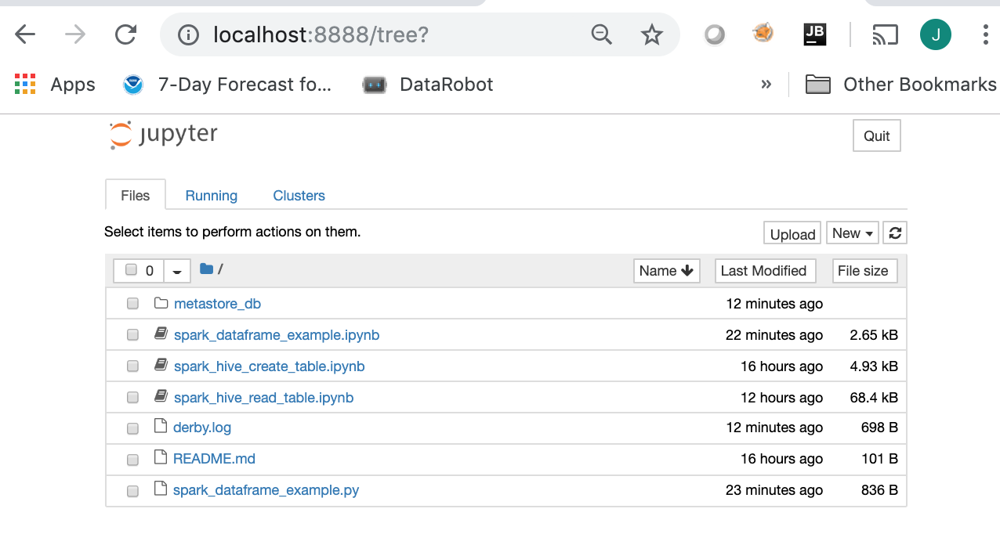

# Stand-alone Spark Cluster Using Docker Containers

This [blog posting](https://medium.com/@marcovillarreal_40011/creating-a-spark-standalone-cluster-with-docker-and-docker-compose-ba9d743a157f) inspired the work described in this repo.  The steps described in this repo use a different approach in creating the Docker images.  One result of this different approach is the availability of a PySpark Jupyter Notebook Server.  This repo demonstrates how to run a stand-alone Spark cluster using Docker Containers with `docker-compose` and `kubernetes`.  The work described here was performed on a MacBook Pro (MacOS 10.14.4) and Docker for Mac (2.0.0.3).

## Overview
Components of the stand-alone cluster:

* PySpark Jupyter Notebook Server with directory for the notebooks
* Stand-alone Spark Master
* 2 Spark Workers
* All four processes share a data directory that simulates a distributed file system


## Building the Docker Images
Three Docker images are required to run the Spark cluster:
* `spark-master` - Spark Stand-alone Cluster manager
* `spark-worker` - Spark worker process
* `spark-pyspnb` - PySpark Jupyter Notebook Server

These three images are based on a custom `spark-base` image built using the [`continuumio/anaconda3`](https://hub.docker.com/r/continuumio/anaconda3/) image, which provides the the required Python libraries.  To this image we add the following to provide the Spark run-time:
* Java 1.8
* Apache Spark ([pre-built binaries](https://spark.apache.org/downloads.html))
* Miscellenous system utilities to support running Apache Spark

First configure the build script (`docker/build_images.sh`) to specify software versions desired.  If different versions are desired, then these parameters can be changed.
```
# Version of ContinuumIO's Anaconda3 docker image to use as the base image 
ANACONDA3_VERSION=5.3.0

# Version of pre-built  Apache spark and Hadoop from spark.apache.org
APACHE_SPARK_VERSION=2.4.1
HADOOP_VERSION=2.7

# Version of py4j used in the Spark build
PY4J_VERSION=0.10.7
```

Run the following command to build the required images:
```
cd docker
./build_images.sh
```

## Running the Stand-alone Spark Cluster

To run the cluster with `docker-compose` go to `spark-cluster/dc` and follow [these instructions](spark-cluster/dc).

To run the cluster with `kubernetes` go to `spark-cluster/k8s` and follow [these instructions](spark-cluster/k8s).

## Web UI Sample Pages
### \>\> Screen shots of Pyspark Jupyter Notebook Server (`http://localhost:8888`) \<\<
### Jupyter Notebook Home Page



### Example PySpark Jupyter Notebook


### \>\> Screen shots of Spark Master Web UI (`http://localhost:8080`) \<\<
### Spark Master Web UI - Main Page


### Spark Job Web UI
