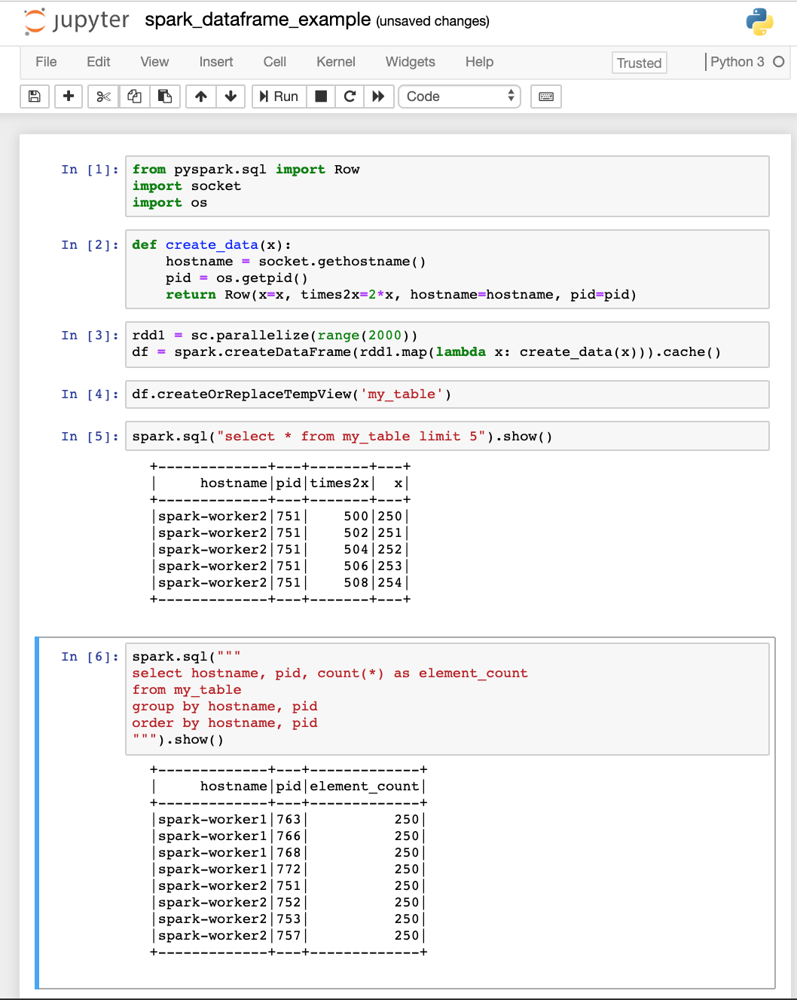
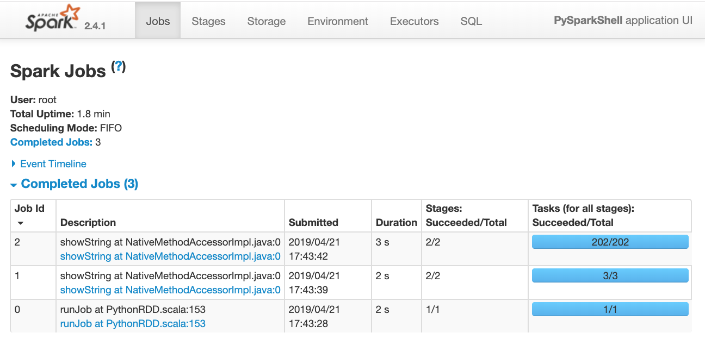

# Spark Stand-alone Cluster with `docker-compose`

## Starting Stand-alone Spark Cluster
First, specify the parameters to be used in `docker-compose`.  These parameters are specified in the `.env`.  A sample file (`spark-cluster/dc/dot_env`) is provided in this repo.  Modify the parameters as needed then rename `dot_env` to `.env`.

Contents of `spark-cluster/dc/dot_env`:
```
#
# Sample file.  Rename this to .env after specifying values for the variables below
# Environment variables to set for docker-compose file
#

# Docker image tag for the version of Spark to run
APACHE_SPARK_VERSION=2.4.1

# Fully qualified path to directory containing source that will be attached the PySpark Jupyter Notebook container.
# This is mapped `/opt/project` in the container.
CODE_DIR=/top_level_dir/subdir1/subdir1/code_dir

# Fully qualified path to directory that will serve as the persistent storage for the simulated distributed file system.
# This is mapped `/spark/data` in the container.
DATA_DIR=/top_level_dir/subdirx/data_dir
```

After modifying `spark-cluster/dc/dot_env` and renaming to `spark-cluster/dc/.env`, the Spark cluster can be started as follows:
```
cd spark-cluster/dc
docker-compose up --detach
```

To verify the cluster successfully started, run the `docker-compose ps` command.  The output should look similar to below.  
```
          Name                         Command               State                                   Ports
-------------------------------------------------------------------------------------------------------------------------------------------
dc_pyspnb-client_1   /usr/bin/tini -- /spark/st ...   Up      0.0.0.0:4040->4040/tcp, 0.0.0.0:4041->4041/tcp, 0.0.0.0:8888->8888/tcp
dc_spark-master_1    /usr/bin/tini -- /spark/st ...   Up      0.0.0.0:8080->8080/tcp
dc_spark-worker1_1   /usr/bin/tini -- /spark/st ...   Up      0.0.0.0:18081->18081/tcp
dc_spark-worker2_1   /usr/bin/tini -- /spark/st ...   Up      0.0.0.0:28081->28081/tcp
```

## Shutdown Stand-alone Spark Cluster
From the root directory execute this command
```
cd spark-cluster/dc
docker-compose down
```

## Web Access to the Stand-alone Spark Cluster
The following web UIs are available:

|WEB UI|URL|
|------|---|
|PySpark Jupyter Notebook Server|`http://localhost:8888`|
|Spark Master Web UI|`http://localhost:8080`|


### \>\> Screen shots of Pyspark Jupyter Notebook Server (`http://localhost:8888`) \<\<
### Jupyter Notebook Home Page


### Example PySpark Jupyter Notebook



### \>\> Screen shots of Spark Master Web UI (`http://localhost:8080`) \<\<
### Spark Master Web UI - Main Page


### Spark Job Web UI


## Using `spark-submit` on the Stand-alone Spark Cluster
In addition to a PySpark Jupyter Notebook Server, it is possible to use the `spark-submit` cli to submit work to the cluster.  These are the steps to use `spark-submit`:

* Connect to the `pyspnb` container using `docker exec -it dc_pyspnb-client_1 /bin/bash` command.  Note:  Container name is the one dispalyed for the `pyspnb` image shown by the `docker-compose ps` command.
* Navigate to the container directory containing program to run with `spark-submit`
* Execute the `spark-submit` command

Following illustrates the above steps with embedded commentary.
```
#
# On the host, execute `docker exec`
#
Jim-MacBook-Pro:~ jim$ docker exec -it dc_pyspnb-client_1 /bin/bash

#
# Following commands are executed in the dc_pyspnb-client_1 container
#
(base) root@pyspnb-client:/opt/project# hostname
pyspnb-client
(base) root@pyspnb-client:/# pwd
/
(base) root@pyspnb-client:/# ls
bin  boot  dev	etc  home  lib	lib64  media  mnt  opt	proc  root  run  sbin  spark  srv  sys	tmp  usr  var

#
# navigate to the directory in the container with program to run
#
(base) root@pyspnb-client:/# cd /opt/project
(base) root@pyspnb-client:/opt/project# ls
README.md    derby.log	   spark_dataframe_example.ipynb  spark_hive_create_table.ipynb
__pycache__  metastore_db  spark_dataframe_example.py	  spark_hive_read_table.ipynb

#
# Execute `spark-submit` specifying spark-master and Python progrma to run.
#
(base) root@pyspnb-client:/opt/project# spark-submit --master spark://spark-master:7077 spark_dataframe_example.py
19/04/21 17:52:41 WARN NativeCodeLoader: Unable to load native-hadoop library for your platform... using builtin-java classes where applicable
Using Spark's default log4j profile: org/apache/spark/log4j-defaults.properties
19/04/21 17:52:42 INFO SparkContext: Running Spark version 2.4.1
19/04/21 17:52:42 INFO SparkContext: Submitted application: PySpark - Test
19/04/21 17:52:42 INFO SecurityManager: Changing view acls to: root
19/04/21 17:52:42 INFO SecurityManager: Changing modify acls to: root
19/04/21 17:52:42 INFO SecurityManager: Changing view acls groups to:
19/04/21 17:52:42 INFO SecurityManager: Changing modify acls groups to:
19/04/21 17:52:42 INFO SecurityManager: SecurityManager: authentication disabled; ui acls disabled; users  with view permissions: Set(root); groups with view permissions: Set(); users  with modify permissions: Set(root); groups with modify permissions: Set()
19/04/21 17:52:42 INFO Utils: Successfully started service 'sparkDriver' on port 35171.
19/04/21 17:52:42 INFO SparkEnv: Registering MapOutputTracker
19/04/21 17:52:42 INFO SparkEnv: Registering BlockManagerMaster
19/04/21 17:52:42 INFO BlockManagerMasterEndpoint: Using org.apache.spark.storage.DefaultTopologyMapper for getting topology information
19/04/21 17:52:42 INFO BlockManagerMasterEndpoint: BlockManagerMasterEndpoint up
19/04/21 17:52:42 INFO DiskBlockManager: Created local directory at /tmp/blockmgr-af98fe96-6233-4559-8c98-1f3157876bf8
19/04/21 17:52:42 INFO MemoryStore: MemoryStore started with capacity 366.3 MB
19/04/21 17:52:42 INFO SparkEnv: Registering OutputCommitCoordinator
19/04/21 17:52:43 INFO Utils: Successfully started service 'SparkUI' on port 4040.
19/04/21 17:52:43 INFO SparkUI: Bound SparkUI to 0.0.0.0, and started at http://localhost:4040
19/04/21 17:52:43 INFO StandaloneAppClient$ClientEndpoint: Connecting to master spark://spark-master:7077...
19/04/21 17:52:43 INFO TransportClientFactory: Successfully created connection to spark-master/172.23.0.5:7077 after 59 ms (0 ms spent in bootstraps)
19/04/21 17:52:43 INFO StandaloneSchedulerBackend: Connected to Spark cluster with app ID app-20190421175243-0005
19/04/21 17:52:43 INFO Utils: Successfully started service 'org.apache.spark.network.netty.NettyBlockTransferService' on port 43883.
19/04/21 17:52:43 INFO NettyBlockTransferService: Server created on pyspnb-client:43883
19/04/21 17:52:43 INFO BlockManager: Using org.apache.spark.storage.RandomBlockReplicationPolicy for block replication policy
19/04/21 17:52:43 INFO StandaloneAppClient$ClientEndpoint: Executor added: app-20190421175243-0005/0 on worker-20190421173102-172.23.0.4-36343 (172.23.0.4:36343) with 4 core(s)
19/04/21 17:52:43 INFO StandaloneSchedulerBackend: Granted executor ID app-20190421175243-0005/0 on hostPort 172.23.0.4:36343 with 4 core(s), 1024.0 MB RAM
19/04/21 17:52:43 INFO StandaloneAppClient$ClientEndpoint: Executor added: app-20190421175243-0005/1 on worker-20190421173102-172.23.0.2-35975 (172.23.0.2:35975) with 4 core(s)
19/04/21 17:52:43 INFO StandaloneSchedulerBackend: Granted executor ID app-20190421175243-0005/1 on hostPort 172.23.0.2:35975 with 4 core(s), 1024.0 MB RAM
19/04/21 17:52:43 INFO StandaloneAppClient$ClientEndpoint: Executor updated: app-20190421175243-0005/0 is now RUNNING
19/04/21 17:52:43 INFO StandaloneAppClient$ClientEndpoint: Executor updated: app-20190421175243-0005/1 is now RUNNING
19/04/21 17:52:43 INFO BlockManagerMaster: Registering BlockManager BlockManagerId(driver, pyspnb-client, 43883, None)
19/04/21 17:52:43 INFO BlockManagerMasterEndpoint: Registering block manager pyspnb-client:43883 with 366.3 MB RAM, BlockManagerId(driver, pyspnb-client, 43883, None)
19/04/21 17:52:43 INFO BlockManagerMaster: Registered BlockManager BlockManagerId(driver, pyspnb-client, 43883, None)
19/04/21 17:52:43 INFO BlockManager: Initialized BlockManager: BlockManagerId(driver, pyspnb-client, 43883, None)
19/04/21 17:52:43 INFO StandaloneSchedulerBackend: SchedulerBackend is ready for scheduling beginning after reached minRegisteredResourcesRatio: 0.0
19/04/21 17:52:44 INFO SharedState: Setting hive.metastore.warehouse.dir ('null') to the value of spark.sql.warehouse.dir ('file:/opt/project/spark-warehouse').
19/04/21 17:52:44 INFO SharedState: Warehouse path is 'file:/opt/project/spark-warehouse'.
19/04/21 17:52:45 INFO StateStoreCoordinatorRef: Registered StateStoreCoordinator endpoint
19/04/21 17:52:56 WARN ObjectStore: Failed to get database global_temp, returning NoSuchObjectException
+-------------+---+-------+---+
|     hostname|pid|times2x|  x|
+-------------+---+-------+---+
|spark-worker1|644|      0|  0|
|spark-worker1|644|      2|  1|
|spark-worker1|644|      4|  2|
|spark-worker1|644|      6|  3|
|spark-worker1|644|      8|  4|
+-------------+---+-------+---+

+-------------+---+-------------+
|     hostname|pid|element_count|
+-------------+---+-------------+
|spark-worker1|644|         1000|
|spark-worker2|638|         1000|
+-------------+---+-------------+

(base) root@pyspnb-client:/opt/project#
```